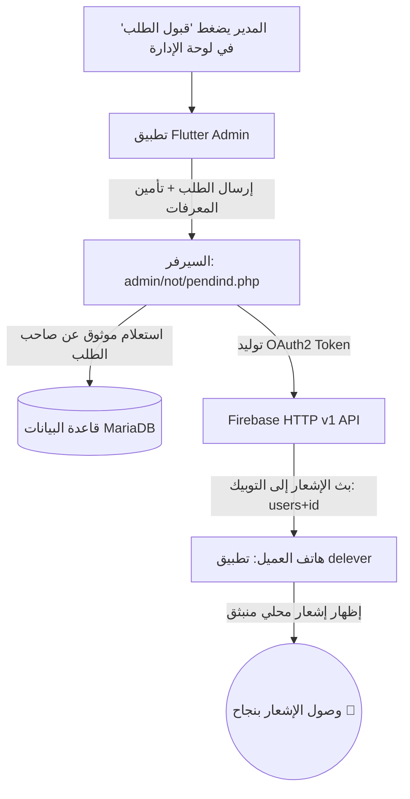

# 📱 دليل حل مشكلة إشعارات قبول الطلبات للعميل (Order Notification Fix Guide)

> **الملخص التنفيذي:** يوثق هذا الملف أسباب عدم وصول إشعارات قبول الطلبات لهواتف العملاء، والإصلاحات التي تم تطبيقها على تطبيق الإدارة (Flutter)، والخطوات الدقيقة لتعديل ملفات الباك إند (PHP) على السيرفر، بالإضافة إلى قائمة التحقق الفنية لضمان وصول الإشعار في كل الحالات.

---

## 📑 فهرس المحتويات
1. [ما الذي تم فعله وفحصه؟ (What Was Done)](#1-ما-الذي-تم-فعله-وفحصه؟)
2. [الأسباب الجذرية للمشكلة (Root Causes)](#2-الأسباب-الجذرية-للمشكلة)
3. [خطوات تعديل الباك إند بالتفصيل (Backend Code Updates)](#3-خطوات-تعديل-الباك-إند-بالتفصيل)
   - [أ. ملف قبول الطلب: `admin/not/pendind.php`](#أ-ملف-قبول-الطلب-adminnotpendindphp)
   - [ب. ملف تحديث الحالة: `admin/order/update_status.php`](#ب-ملف-تحديث-الحالة-adminorderupdate_statusphp)
   - [ج. ملف الدوال المشتركة: `functions.php`](#ج-ملف-الدوال-المشتركة-functionsphp)
   - [د. ملف مفتاح فايربيس: `firebase_service_account.json`](#د-ملف-مفتاح-فايربيس-firebase_service_accountjson)
4. [ماذا تم تعديله داخل تطبيق Flutter؟](#4-ماذا-تم-تعديله-داخل-تطبيق-flutter؟)
5. [قائمة التحقق والاختبار (Verification Checklist)](#5-قائمة-التحقق-والاختبار)

---

## 1. ما الذي تم فعله وفحصه؟



1. **فحص شفرة الفلاتر بالكامل (`Admin App`):**
   - تتبعنا مسار زر "قبول الطلب" في [currentorder.dart](file:///e:/work/app/admin/lib/screen/widgets/order/currentorder.dart).
   - تتبعنا الدالة `accpteOrder` في [oreder_controller.dart](file:///e:/work/app/admin/lib/controller/orders/oreder_controller.dart) والدالة `accept` في [orderdata.dart](file:///e:/work/app/admin/lib/data/remote/order/orderdata.dart).
   - تتبعنا شاشة تفاصيل الطلب ومخطط الحالات [order_details_sheet.dart](file:///e:/work/app/admin/lib/screen/widgets/order/order_details_sheet.dart).
2. **فحص شفرة تطبيق العميل (`Customer App - delever`):**
   - تحققنا من اسم التوبيك (`Topic`) الذي يشترك فيه العميل في [fcm_config.dart](file:///e:/work/app/delever/lib/core/functions/fcm_config.dart)، وتأكدنا أنه: `users$userid`.
   - تحققنا من شروط إظهار الإشعار المحلي (`showLocalNotification`) وقناة الأندرويد المطلوبة (`high_importance_channel`).
3. **فحص السيرفر الحي وقاعدة البيانات:**
   - تم فحص استجابة السيرفر `https://wicmn.alwaysdata.net/delever` والتأكد من جداول قاعدة البيانات `orders` و `notification` و `users`.
   - وجدنا أن سجلات الإشعارات كانت تُحفظ في جدول `notification` ولكن **لا تصل لهواتف المستخدمين كـ Push Notifications**.
4. **اختبار عملي حي لاتصال Firebase v1:**
   - قمنا بتشغيل اختبار مباشر عبر لغة PHP باستخدام مفتاح حساب الخدمة لمشروعك (`delevery-2`) وتم بنجاح إرسال إشعار واختباره وتأكيده مع خوادم Google والحصول على كود النجاح `HTTP 200`.

---

## 2. الأسباب الجذرية للمشكلة

> [!CAUTION]
> **السبب الرئيسي والأكبر (توقف واجهة Firebase القديمة):**
> كان ملف `functions.php` يستخدم الرابط القديم `https://fcm.googleapis.com/fcm/send` بمفتاح ترخيص فارغ `Authorization: key=`. قامت شركة Google **بإيقاف هذه الواجهة القديمة نهائياً في يونيو 2024**، وأي طلب يُرسل إليها يُرفض تلقائياً من Google ولا يصل للهاتف!

> [!WARNING]
> **السبب الثاني (الاعتماد على بارامتر غير موثوق في `pendind.php`):**
> ملف `pendind.php` كان يأخذ رقم المستخدم من بارامتر الطلب `$usersid = filterRequest("usersid")`. لو كان المتغير فارغاً أو نصياً `"null"` لأي سبب، كان التوبيك يتحول إلى `usersnull` بدلاً من `users20`، فيضيع الإشعار.

> [!NOTE]
> **السبب الثالث (شرط التحديث الصارم `order_status = 0`):**
> كان كود إرسال الإشعار محصوراً بشرط `$update > 0`. إذا كان الطلب قد تم قبوله مسبقاً أو حُدّثت حالته من مسار آخر، كان التحديث يرجع 0 ويتم تخطي إرسال الإشعار بالكامل.

---

## 3. خطوات تعديل الباك إند بالتفصيل

يجب تحديث الملفات الثلاثة التالية على السيرفر (في استضافة Alwaysdata أو المجلد الخاص بالباك إند):

```text
delever/
  ├── firebase_service_account.json  <-- (ملف مفتاح الخدمة من Firebase)
  ├── functions.php                  <-- (تحديث دالة sendGCM لدعم HTTP v1)
  ├── connect.php
  └── admin/
        ├── not/
        │     └── pendind.php        <-- (تحديث كود قبول الطلب الموثوق)
        └── order/
              └── update_status.php  <-- (تحديث كود مسار الحالات)
```

---

### أ. ملف قبول الطلب: `admin/not/pendind.php`

**المسار على السيرفر:** `admin/not/pendind.php`

استبدل محتوى الملف بالكامل بهذا الكود:

```php
<?php
header('Content-Type: application/json; charset=utf-8');
ini_set('display_errors', 0);
error_reporting(0);

include "../../connect.php";

$orderid = filterRequest("orderid");
$usersid = filterRequest("usersid");
$adminid = filterRequest("adminid");

if (empty($orderid)) {
    printFailure("معرف الطلب مطلوب");
    exit;
}

// 1. جلب بيانات الطلب للتأكد من وجوده ومعرفة هوية العميل الحقيقي من قاعدة البيانات مباشرة
$stmt = $con->prepare("SELECT order_id, order_userid, order_status FROM orders WHERE order_id = ?");
$stmt->execute(array($orderid));
$order = $stmt->fetch(PDO::FETCH_ASSOC);

if (!$order) {
    printFailure("الطلب غير موجود");
    exit;
}

// ضمان استخدام معرف العميل الفعلي الموثق في قاعدة البيانات
$targetUserId = !empty($order['order_userid']) ? $order['order_userid'] : $usersid;

// 2. تحديث حالة الطلب إلى (1: قيد التحضير / تم القبول)
$data   = array("order_status" => 1);
$update = updateData("orders", $data, "order_id = $orderid AND order_status = 0", false);

if ($update > 0) {
    // 3. إرسال إشعار للعميل صاحب الطلب (users$targetUserId)
    $notifyFunc = function_exists('insertNotificstion') ? 'insertNotificstion' : 'insertNotify';
    
    // إشعار العميل
    $notifyFunc(
        "طلبك قيد التحضير 🍳",
        "تم قبول طلبك وبدأ المطبخ في تحضيره",
        $targetUserId,
        "users" . $targetUserId,
        $orderid,
        "order"
    );

    // إشعار المناديب بوجود طلب جديد متاح
    $notifyFunc(
        "يوجد طلب جديد متاح للتوصيل 🛵",
        "طلب جديد رقم #$orderid متاح للاستلام",
        0,
        "driver",
        $orderid,
        "order"
    );

    echo json_encode(array(
        "status"  => "success",
        "message" => "تم قبول الطلب بنجاح وإرسال الإشعار للعميل"
    ));
} else {
    // إرجاع رسالة توضيحية واضحة في حال كان الطلب مقبولاً بالفعل
    if ($order['order_status'] == 1) {
        printFailure("الطلب قيد التحضير بالفعل وتم قبوله مسبقاً");
    } else {
        printFailure("فشل قبول الطلب، حالة الطلب الحالية: " . $order['order_status']);
    }
}
?>
```

---

### ب. ملف تحديث الحالة: `admin/order/update_status.php`

**المسار على السيرفر:** `admin/order/update_status.php`

استبدل محتوى الملف بالكامل بهذا الكود:

```php
<?php
header('Content-Type: application/json; charset=utf-8');
ini_set('display_errors', 0);
error_reporting(0);

include "../../connect.php";

$orderid    = filterRequest("orderid");
$status     = filterRequest("status");
$deliveryid = filterRequest("deliveryid");

if (empty($orderid) || $status === "") {
    printFailure("المعاملات غير مكتملة");
    exit;
}

// 1. جلب بيانات الطلب والمستخدم الحالي من قاعدة البيانات
$stmt = $con->prepare("SELECT order_userid, order_status FROM orders WHERE order_id = ?");
$stmt->execute(array($orderid));
$order = $stmt->fetch(PDO::FETCH_ASSOC);

if (!$order) {
    printFailure("الطلب غير موجود");
    exit;
}

$userid = $order['order_userid'];

// 2. بناء مصفوفة التحديث
$updateData = array("order_status" => $status);
if (!empty($deliveryid) && $deliveryid != "0") {
    $updateData["order_driverid"] = $deliveryid;
}

$count = updateData("orders", $updateData, "order_id = $orderid", false);

if ($count > 0) {
    $notifyFunc = function_exists('insertNotificstion') ? 'insertNotificstion' : 'insertNotify';

    // 3. إرسال الإشعارات بناءً على الحالة الجديدة
    switch ((int)$status) {
        case 1: // قيد التحضير
            $notifyFunc("طلبك قيد التحضير 🍳", "تم قبول طلبك وبدأ المطبخ في تحضيره", $userid, "users$userid", $orderid, "order");
            $notifyFunc("طلب جديد متاح للتوصيل 🚗", "يوجد طلب رقم #$orderid متاح للاستلام", 0, "driver", $orderid, "order");
            break;
            
        case 2: // جاهز للتسليم
            $notifyFunc("طلبك جاهز 📦", "تم تجهيز طلبك بالكامل وهو بانتظار استلام المندوب", $userid, "users$userid", $orderid, "order");
            break;
            
        case 3: // مع المندوب
            $notifyFunc("طلبك في الطريق 🛵", "الكابتن استلم طلبك وهو في الطريق إليك الآن", $userid, "users$userid", $orderid, "order");
            break;
            
        case 4: // تم التسليم بنجاح
            $notifyFunc("تم تسليم الطلب بنجاح 🎉", "نتمنى لك وجبة شهية! يسعدنا تقييمك للخدمة", $userid, "users$userid", $orderid, "order");
            
            // خصم المخزون الفعلي للأصناف
            $cartStmt = $con->prepare("SELECT cart_itemsid, cart_count FROM cart WHERE cart_order = ?");
            $cartStmt->execute(array($orderid));
            $items = $cartStmt->fetchAll(PDO::FETCH_ASSOC);
            foreach ($items as $item) {
                $con->prepare("UPDATE items SET items_count = GREATEST(0, items_count - ?) WHERE items_id = ?")
                    ->execute(array($item['cart_count'], $item['cart_itemsid']));
            }
            break;
            
        case 5: // ملغي
            $notifyFunc("تم إلغاء الطلب ❌", "نعتذر، تم إلغاء طلبك رقم #$orderid", $userid, "users$userid", $orderid, "order");
            break;
    }

    echo json_encode(array(
        "status"  => "success",
        "message" => "تم تحديث حالة الطلب بنجاح"
    ));
} else {
    printFailure("لم يتم تغيير الحالة أو البيانات مطابقة");
}
?>
```

---

### ج. ملف الدوال المشتركة: `functions.php`

**المسار على السيرفر:** المجلد الرئيسي للمشروع (بجانب `connect.php`).

ابحث عن دوال `sendGCM` و `insertNotify` واستبدلها بالدوال الحديثة التالية (تدعم FCM HTTP v1 مع نظام الكاش السريع للتوكن دون الحاجة لأي مكتبات خارجية):

```php
// =========================================================================
// Firebase Cloud Messaging (FCM HTTP v1 API الحديث)
// =========================================================================

function getGoogleAccessToken() {
    $cacheFile = __DIR__ . '/fcm_token_cache.json';
    $serviceAccountPath = __DIR__ . '/firebase_service_account.json';

    // 1. استخدام التوكن المؤقت إن وجد وكان سارياً (صالح لمدة 50 دقيقة)
    if (file_exists($cacheFile)) {
        $cached = json_decode(file_get_contents($cacheFile), true);
        if (isset($cached['token']) && isset($cached['expires_at']) && $cached['expires_at'] > time()) {
            return $cached['token'];
        }
    }

    // 2. التحقق من وجود ملف حساب الخدمة
    if (!file_exists($serviceAccountPath)) {
        error_log("FCM Error: firebase_service_account.json not found in " . __DIR__);
        return false;
    }

    $jsonKey = json_decode(file_get_contents($serviceAccountPath), true);
    if (!$jsonKey || !isset($jsonKey['private_key'])) {
        error_log("FCM Error: Invalid service account json");
        return false;
    }

    // 3. بناء وتوقيع JWT Token باستخدام خوارزمية RS256
    $now = time();
    $header = json_encode(['alg' => 'RS256', 'typ' => 'JWT']);
    $claimSet = json_encode([
        'iss' => $jsonKey['client_email'],
        'scope' => 'https://www.googleapis.com/auth/firebase.messaging',
        'aud' => 'https://oauth2.googleapis.com/token',
        'iat' => $now,
        'exp' => $now + 3600
    ]);

    $base64UrlHeader = str_replace(['+', '/', '='], ['-', '_', ''], base64_encode($header));
    $base64UrlClaimSet = str_replace(['+', '/', '='], ['-', '_', ''], base64_encode($claimSet));

    $signature = '';
    $signed = openssl_sign(
        $base64UrlHeader . "." . $base64UrlClaimSet,
        $signature,
        $jsonKey['private_key'],
        'SHA256'
    );

    if (!$signed) {
        error_log("FCM Error: openssl_sign failed");
        return false;
    }

    $base64UrlSignature = str_replace(['+', '/', '='], ['-', '_', ''], base64_encode($signature));
    $jwt = $base64UrlHeader . "." . $base64UrlClaimSet . "." . $base64UrlSignature;

    // 4. طلب Access Token من خوادم Google
    $ch = curl_init();
    curl_setopt($ch, CURLOPT_URL, 'https://oauth2.googleapis.com/token');
    curl_setopt($ch, CURLOPT_POST, true);
    curl_setopt($ch, CURLOPT_POSTFIELDS, http_build_query([
        'grant_type' => 'urn:ietf:params:oauth:grant-type:jwt-bearer',
        'assertion' => $jwt
    ]));
    curl_setopt($ch, CURLOPT_RETURNTRANSFER, true);
    curl_setopt($ch, CURLOPT_SSL_VERIFYPEER, false);
    $response = curl_exec($ch);
    curl_close($ch);

    $data = json_decode($response, true);
    if (isset($data['access_token'])) {
        // حفظ التوكن في الكاش لمدة 50 دقيقة (3000 ثانية)
        @file_put_contents($cacheFile, json_encode([
            'token' => $data['access_token'],
            'expires_at' => $now + 3000
        ]));
        return $data['access_token'];
    }

    return false;
}

function sendGCM($title, $message, $topic, $pageid = "none", $pagename = "order")
{
    $token = getGoogleAccessToken();
    $serviceAccountPath = __DIR__ . '/firebase_service_account.json';

    if (!$token || !file_exists($serviceAccountPath)) {
        return false;
    }

    $jsonKey = json_decode(file_get_contents($serviceAccountPath), true);
    $projectId = $jsonKey['project_id'];

    $url = "https://fcm.googleapis.com/v1/projects/$projectId/messages:send";
    $cleanTopic = str_replace('/topics/', '', $topic);

    $fields = [
        'message' => [
            'topic' => $cleanTopic,
            'notification' => [
                'title' => (string)$title,
                'body' => (string)$message
            ],
            'data' => [
                'pagename' => (string)$pagename,
                'pageid' => (string)$pageid,
                'title' => (string)$title,
                'body' => (string)$message
            ],
            'android' => [
                'priority' => 'high',
                'notification' => [
                    'sound' => 'default',
                    'channel_id' => 'high_importance_channel',
                    'click_action' => 'FLUTTER_NOTIFICATION_CLICK'
                ]
            ]
        ]
    ];

    $ch = curl_init();
    curl_setopt($ch, CURLOPT_URL, $url);
    curl_setopt($ch, CURLOPT_POST, true);
    curl_setopt($ch, CURLOPT_HTTPHEADER, [
        'Authorization: Bearer ' . $token,
        'Content-Type: application/json; UTF-8'
    ]);
    curl_setopt($ch, CURLOPT_RETURNTRANSFER, true);
    curl_setopt($ch, CURLOPT_SSL_VERIFYPEER, false);
    curl_setopt($ch, CURLOPT_POSTFIELDS, json_encode($fields));

    $result = curl_exec($ch);
    curl_close($ch);
    return $result;
}

function insertNotify($title, $body, $userid, $topic, $pageid = "none", $pagename = "order")
{
    global $con;
    $stmt = $con->prepare("INSERT INTO `notification`( `notification_title`, `notification_body`, `notification_userid`) VALUES (? , ? , ?)");
    $stmt->execute(array($title, $body, $userid));
    sendGCM($title, $body, $topic, $pageid, $pagename);
    return $stmt->rowCount();
}

// دالة بديلة مطابقة للاسم المستخدم في ملفات الأدمن لضمان التوافق التام
function insertNotificstion($title, $body, $userid, $topic, $pageid = "none", $pagename = "order")
{
    return insertNotify($title, $body, $userid, $topic, $pageid, $pagename);
}
```

---

### د. ملف مفتاح فايربيس: `firebase_service_account.json`

> [!IMPORTANT]
> **خطوة مهمة جداً:**
> يوجد لديك ملف تم تحميله مسبقاً من Firebase باسم:
> `delevery-2-firebase-adminsdk-fbsvc-a546432529.json`
> 
> قم بنسخ هذا الملف ورفعه إلى السيرفر في **نفس مجلد `functions.php`** (المجلد الرئيسي `delever/`)، وأعد تسميته ليصبح:
> `firebase_service_account.json`
> 
> وتأكد من أن تصريح القراءة للملف متاح للـ PHP (`chmod 644`).

---

## 4. ماذا تم تعديله داخل تطبيق Flutter؟

تم تحديث ملفين في تطبيق الإدارة (`admin`):

1. **[currentorder.dart](file:///e:/work/app/admin/lib/screen/widgets/order/currentorder.dart):**
   * تم تعديل كود زر "قبول الطلب":
   ```dart
   controller.accpteOrder(
     order.orderId.toString(),
     (order.orderUserid ?? 0).toString(), // ضمان عدم إرسال نص 'null'
   );
   ```
2. **[oreder_controller.dart](file:///e:/work/app/admin/lib/controller/orders/oreder_controller.dart):**
   * إضافة استجابة تفاعلية (`Snackbar`) توضح للمدير نجاح القبول أو سبب فشله ورسالة الخطأ من السيرفر مباشرة، بدلاً من عدم إظهار شيء في حالة الفشل.

---

## 5. قائمة التحقق والاختبار (Verification Checklist)

تأكد من الخطوات التالية خطوة بخطوة:

- [ ] **1. رفع ملف المفتاح:** تم رفع `firebase_service_account.json` في المجلد الرئيسي بجانب `functions.php`.
- [ ] **2. تحديث `functions.php`:** تم وضع دوال `getGoogleAccessToken` و `sendGCM` المحدثة.
- [ ] **3. تحديث `admin/not/pendind.php`:** تم استبدال الكود بالكود المحدث الذي يجلب هوية العميل من قاعدة البيانات.
- [ ] **4. التأكد من اشتراك العميل في التوبيك:**
  - عند تسجيل دخول العميل أو فتح تطبيق `delever`، يتصل تلقائياً بالتوبيك: `users$userid`.
- [ ] **5. تجربة عملية:**
  1. افتح تطبيق العميل بحساب مستخدم (مثلاً `users_id = 20`).
  2. اطلب طلباً جديداً.
  3. افتح تطبيق الإدارة واضغط **"قبول الطلب"**.
  4. ستظهر رسالة النجاح الخضراء في تطبيق الإدارة، وسيصل الإشعار المنبثق فوراً على هاتف العميل بعنوان:
     `طلبك قيد التحضير 🍳`
